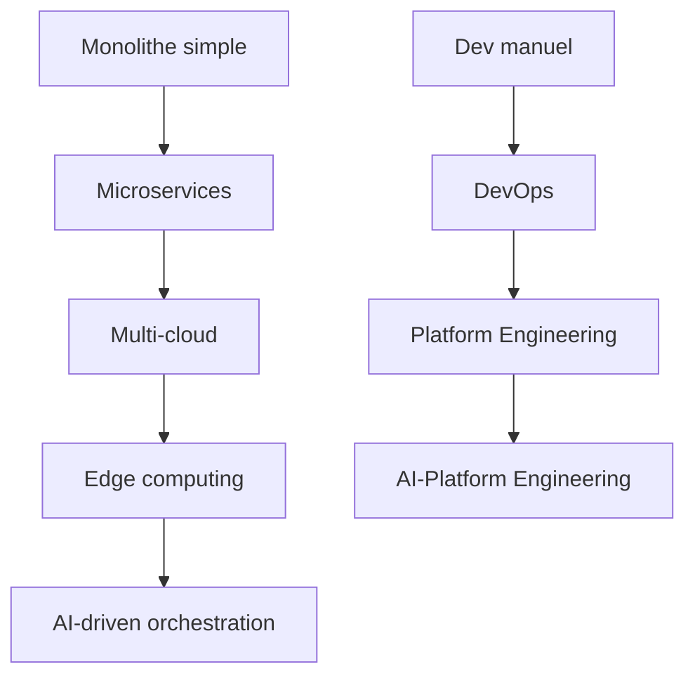

# 1. Welcome to the Age of Intelligent Platforms

*Pourquoi les Developer Platforms deviennent AI-Powered*

---

## 📖 Le contexte historique

### De l'automatisation à l'intelligence

Les plateformes de développement ont évolué selon cette séquence naturelle :

```
1970s: Programmation manuelle
1980s: IDE et outils de développement
1990s: Version control et collaboration
2000s: DevOps et automatisation
2010s: Cloud et Infrastructure as Code
2020s: AI-Powered Development
```

### Le tipping point de 2023

L'arrivée de GPT-4 et Claude a marqué un tournant :
- **Capacités cognitives** dépassant les tâches répétitives
- **Compréhension contextuelle** des codebases complexes
- **Génération de code** à l'échelle industrielle

---

## 🎯 Pourquoi maintenant ?

### L'explosion de la complexité



**Facteurs de complexité exponentielle :**
- ×10 services à gérer (microservices)
- ×5 environnements (dev/staging/prod/edge/hybrid)
- ×3 clouds providers minimum
- ×100 métriques à monitorer

### Le coût de la complexité

| Métrique | 2015 | 2023 | 2025 (prévision) |
|----------|------|------|------------------|
| Temps déploiement | 2 semaines | 2 heures | 20 minutes |
| Coût outage/minute | $5,000 | $50,000 | $500,000 |
| Lignes de code/app | 10K | 1M | 10M |
| Teams simultanées | 5 | 50 | 500 |

---

## 🔍 Qu'est-ce qu'une AI-Powered Platform ?

### Définition

> **AI-Powered Developer Platform** : Un écosystème intégré où l'Intelligence Artificielle agit comme copilote stratégique, automatisant non seulement les tâches répétitives mais aussi les décisions complexes d'architecture, d'optimisation et de gouvernance.

### Caractéristiques clés

#### 🤖 Intelligence omniprésente
- **Auto-optimisation** : Les pipelines s'adaptent automatiquement
- **Prédiction d'incidents** : Détection proactive des problèmes
- **Recommandations contextuelles** : Suggestions basées sur le comportement historique

#### 🔄 Feedback loops continus
- **Learning from production** : L'IA apprend de chaque déploiement
- **Continuous improvement** : Amélioration automatique des performances
- **Self-healing systems** : Récupération automatique des erreurs

#### 👥 Human-AI collaboration
- **Augmentation, pas remplacement** : L'IA amplifie les capacités humaines
- **Decision support** : Aide à la prise de décision complexe
- **Knowledge sharing** : Transfert automatique de savoir-faire

---

## 💡 Les promesses de transformation

### Pour les développeurs

#### Avant : Développeur "coder"
- 70% du temps : Debugging, testing, déploiement
- 20% du temps : Architecture et design
- 10% du temps : Innovation pure

#### Après : Développeur "architecte d'IA"
- 20% du temps : Définition des objectifs métier
- 30% du temps : Orchestration des composants IA
- 50% du temps : Innovation et optimisation créative

### Pour les organisations

#### Métriques de succès
- **Developer Velocity** : +300% de productivité
- **Time to Market** : -80% pour les features complexes
- **Quality Metrics** : -90% des bugs en production
- **Cost Efficiency** : -60% des coûts opérationnels

---

## ⚠️ Les défis à anticiper

### Risques technologiques

#### 📊 Data quality bottleneck
```
Si les données d'entraînement sont mauvaises :
├── Modèles biaisés
├── Prédictions erronées
└── Décisions automatiques dangereuses
```

#### 🔒 Security concerns
- **Prompt injection attacks**
- **Model poisoning**
- **Data leakage risks**

#### ⚡ Performance overhead
- **Latence IA** dans les pipelines critiques
- **Coût computationnel** des modèles avancés
- **Resource contention** avec les workloads existants

### Défis organisationnels

#### 🧠 Skills gap
- **Manque d'experts IA** dans les équipes DevOps
- **Resistance au changement** culturelle
- **Formation continue** nécessaire

#### 🎯 Governance challenges
- **Qui contrôle les décisions IA ?**
- **Comment auditer les modèles ?**
- **Responsabilité des erreurs automatiques**

---

## ✅ Checklist : Êtes-vous prêt pour l'AI-Powered Platform ?

### Évaluation de maturité

#### Infrastructure ✅
- [ ] Kubernetes orchestration
- [ ] Service mesh (Istio/Linkerd)
- [ ] Observability stack (Prometheus/Grafana)

#### Data Foundation ✅
- [ ] Data lake/warehouse
- [ ] Feature store
- [ ] ML pipeline tooling (Kubeflow/MLflow)

#### AI Readiness ✅
- [ ] GPU infrastructure
- [ ] Model serving (Seldon/KFServing)
- [ ] MLOps practices

#### Team Culture ✅
- [ ] DevOps culture established
- [ ] Experimentation mindset
- [ ] Continuous learning practices

---

## 🚀 Prochaines étapes

Dans le chapitre suivant, nous explorerons **l'évolution de DevOps vers DevIntelligence** et comment l'IA transforme chaque étape du cycle de développement.

**Points clés à retenir :**
- L'IA transforme les Developer Platforms en écosystèmes intelligents
- La complexité exponentielle rend l'automatisation IA indispensable
- Le succès dépend autant de la technologie que de la culture organisationnelle
- Les plateformes AI-Powered amplifient les développeurs plutôt que les remplacer
