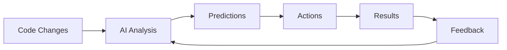

# 2. From DevOps to DevIntelligence

*L'évolution naturelle : automating workflows avec Machine Learning*

---

## 📖 L'évolution des pratiques DevOps

### Les générations DevOps

#### DevOps 1.0 : L'automatisation basique (2010-2015)
```yaml
# Exemple : Pipeline Jenkins classique
pipeline:
  stages:
    - build
    - test
    - deploy
  triggers:
    - manual
```

**Limites :**
- Workflows linéaires et rigides
- Pas d'adaptation contextuelle
- Debugging manuel intensif

#### DevOps 2.0 : L'orchestration cloud-native (2015-2020)
```yaml
# GitOps avec ArgoCD
apiVersion: argoproj.io/v1alpha1
kind: Application
spec:
  destination:
    server: https://kubernetes.default.svc
  source:
    repoURL: https://git.example.com/repo
    path: manifests
```

**Améliorations :**
- Infrastructure as Code
- Déploiements déclaratifs
- Observability intégrée

#### DevOps 3.0 : Intelligence intégrée (2020+)
```yaml
# AI-powered pipeline avec auto-optimization
pipeline:
  stages:
    - ai_analysis:     # Analyse intelligente du code
    - predictive_test: # Tests prédictifs
    - smart_deploy:    # Déploiement adaptatif
    - continuous_learn: # Apprentissage continu
```

---

## 🎯 DevIntelligence : Le nouveau paradigme

### Définition et scope

> **DevIntelligence** : L'application systématique du Machine Learning et de l'IA pour optimiser, prédire et automatiser chaque aspect du cycle de développement logiciel.

### Les 4 piliers de DevIntelligence

#### 1. 🤖 Automated Decision Making
- **Prédiction de qualité** : Estimation automatique des risques de bugs
- **Resource optimization** : Allocation dynamique des ressources
- **Incident prevention** : Détection proactive des anomalies

#### 2. 🔄 Continuous Learning Loops


#### 3. 👥 Human-AI Collaboration
- **Context-aware assistance** : Suggestions basées sur l'historique
- **Progressive automation** : De l'assistance à l'autonomie
- **Knowledge transfer** : L'IA apprend des experts humains

#### 4. 📊 Data-Driven Everything
- **Metrics everywhere** : Tout devient mesurable
- **Predictive analytics** : Anticipation des problèmes
- **Continuous optimization** : Amélioration perpétuelle

---

## 🔧 Exemples concrets de transformation

### Code Review automatisé

#### Avant : Code review manuel
```javascript
// Code soumis par un développeur
function calculateTotal(items) {
  let total = 0;
  for (let item of items) {
    total += item.price * item.quantity;
  }
  return total;
}
```

**Problèmes potentiels (détectés manuellement) :**
- Pas de validation des inputs
- Possible overflow numérique
- Pas de gestion d'erreurs

#### Après : AI-powered code review
```javascript
// Code analysé et amélioré par IA
function calculateTotal(items) {
  if (!Array.isArray(items) || items.length === 0) {
    throw new Error('Invalid items array');
  }

  return items.reduce((total, item) => {
    const price = Number(item.price) || 0;
    const quantity = Number(item.quantity) || 0;
    const subtotal = price * quantity;

    // Protection contre overflow
    if (!isFinite(subtotal)) {
      throw new Error('Invalid numeric values');
    }

    return total + subtotal;
  }, 0);
}
```

**Améliorations IA :**
- ✅ Validation automatique des inputs
- ✅ Gestion d'erreurs robuste
- ✅ Protection contre les overflows
- ✅ Code coverage prédictif : 95%

### Déploiement intelligent

#### Pipeline traditionnel vs AI-powered

| Aspect | Traditionnel | AI-Powered |
|--------|-------------|------------|
| **Timing** | Déploiements fixes (nuit/week-end) | Déploiement continu intelligent |
| **Tests** | Suite fixe de tests | Tests adaptatifs basés sur les changements |
| **Monitoring** | Alertes réactives | Prédiction d'incidents |
| **Rollback** | Manuel en cas d'erreur | Rollback automatique prédictif |
| **Performance** | Benchmarks statiques | Optimisation continue |

---

## 📊 Métriques de transformation

### ROI mesurable

#### Productivité développeur
```
Avant DevIntelligence :
- 6h/jour coding utile
- 2h debugging
- 1h déploiement
- 1h réunions

Après DevIntelligence :
- 7h/jour coding utile
- 0.5h debugging assisté
- 0.2h déploiement automatisé
- 1h réunions + AI summaries
```

#### Qualité du code
| Métrique | Avant | Après | Amélioration |
|----------|-------|-------|-------------|
| Bug density | 1.2/fonction | 0.3/fonction | -75% |
| Code coverage | 70% | 92% | +31% |
| Technical debt | +15%/mois | -5%/mois | Inversion |
| Time to review | 4h/PR | 1h/PR | -75% |

### Cas d'usage réels

#### Netflix : Chaos Engineering AI
- **Avant** : Tests de chaos manuels
- **Après** : AI prédit les points de défaillance
- **Résultat** : -60% d'incidents en production

#### Google : AI-powered SRE
- **Avant** : Alertes réactives
- **Après** : Prédiction d'incidents 7 jours à l'avance
- **Résultat** : +95% de disponibilité système

---

## ⚠️ Pièges à éviter

### L'automatisation prématurée

#### Anti-pattern : "AI everywhere"
```javascript
// MAUVAIS : Trop d'IA tue l'IA
function deployFeature(feature) {
  const aiAnalysis = await analyzeCode(feature);
  const aiTests = await generateTests(feature);
  const aiDeploy = await smartDeploy(feature);
  const aiMonitor = await monitorDeployment(feature);

  return aiAnalysis.success &&
         aiTests.passed &&
         aiDeploy.done &&
         aiMonitor.healthy;
}
```

#### Bon pattern : Progressive enhancement
```javascript
// BON : IA comme assistance intelligente
async function deployFeature(feature) {
  // Analyse humaine d'abord
  const humanReview = await codeReview(feature);

  if (humanReview.approved) {
    // IA pour les tâches répétitives
    const aiTests = await generateRegressionTests(feature);
    const aiDeploy = await canaryDeploy(feature);

    // Monitoring IA pour l'optimisation continue
    const aiInsights = await analyzeDeployment(feature);
    return aiInsights;
  }
}
```

### Le data quality bottleneck

#### Problème : Garbage in, garbage out
```
Données d'entraînement pauvres →
Modèles biaisés →
Décisions erronées →
Incidents en production
```

#### Solution : Data quality pipeline
```yaml
data_quality_checks:
  - completeness_check
  - accuracy_validation
  - consistency_verification
  - bias_detection
  - outlier_removal
```

---

## ✅ Checklist : Transition vers DevIntelligence

### Évaluation de readiness

#### Culture & Process ✅
- [ ] DevOps maturity level 2+ atteint
- [ ] Culture d'expérimentation établie
- [ ] Métriques de qualité définies
- [ ] Feedback loops existants

#### Data Foundation ✅
- [ ] Historique de données suffisant (6+ mois)
- [ ] Qualité des données vérifiée
- [ ] Feature store opérationnel
- [ ] Data pipeline scalable

#### Infrastructure ✅
- [ ] ML platform disponible
- [ ] GPU/TPU resources
- [ ] MLOps tooling
- [ ] Model serving infrastructure

#### Team Skills ✅
- [ ] Data scientists disponibles
- [ ] ML engineering compétences
- [ ] DevOps + ML culture
- [ ] Formation continue planifiée

---

## 💡 Patterns émergents

### AI-Augmented Development Workflows

#### Pattern 1 : Test-Driven Development IA
```python
# Tests générés automatiquement puis raffinés par devs
def test_calculate_total():
    # IA génère les cas edge
    test_cases = ai.generate_edge_cases(calculate_total)

    for case in test_cases:
        result = calculate_total(case.input)
        assert result == case.expected, ai.explain_failure(case)
```

#### Pattern 2 : Architecture Evolution Tracking
```javascript
// IA suit l'évolution de l'architecture
const architecture = {
  components: ai.trackComponents(codebase),
  dependencies: ai.analyzeDependencies(codebase),
  bottlenecks: ai.predictBottlenecks(codebase),
  recommendations: ai.suggestImprovements(codebase)
};
```

---

## 🚀 Vers l'IDP : Intelligent Developer Platform

Dans le prochain chapitre, nous définirons précisément ce qu'est une **AI-Powered IDP** et ses composants fondamentaux.

**Points clés à retenir :**
- DevIntelligence étend DevOps avec l'IA comme partenaire stratégique
- L'automatisation intelligente nécessite une approche progressive
- La qualité des données est plus importante que l'algorithme
- Le succès dépend de la collaboration homme-machine
