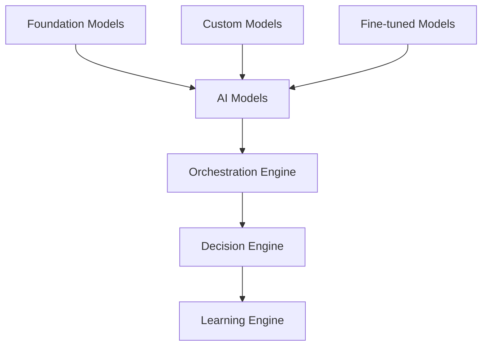

# 3. Understanding the AI-Powered IDP

*Concepts clés, composants, et philosophie d'architecture*

---

## 📖 Qu'est-ce qu'une IDP ?

### Définition formelle

> **Intelligent Developer Platform (IDP)** : Une plateforme unifiée qui intègre des capacités d'Intelligence Artificielle dans chaque couche du cycle de développement, permettant aux équipes de créer, déployer et maintenir des logiciels avec une efficacité et une qualité supérieures.

### Différences avec les plateformes traditionnelles

#### Developer Platform classique
```
Dev → IDE → Git → CI/CD → Cloud → Monitoring
     ↓      ↓     ↓     ↓      ↓       ↓
  Manuel  Local  Push   Build Deploy  Alert
```

#### AI-Powered IDP
```
Dev → AI IDE → Smart Git → ML CI/CD → Auto Cloud → Predictive Monitoring
     ↓         ↓          ↓          ↓          ↓              ↓
Intelligent  Context    Predictive  Adaptive   Optimized     Proactive
```

---

## 🏗️ Architecture de référence

### Les 7 couches d'une IDP

#### 1. 🎯 Experience Layer (Couche Utilisateur)
**Responsabilités :**
- Interfaces conversationnelles (chat, voice)
- Context-aware assistance
- Progressive automation

**Composants clés :**
- **AI Chat Interface** : Communication naturelle avec la plateforme
- **Smart IDE Integration** : Extensions VS Code, IntelliJ
- **Mobile Apps** : Accès mobile aux workflows

#### 2. 🧠 Intelligence Core (Cœur Intelligent)
**Le cerveau de la plateforme**



**Composants :**
- **Model Registry** : Gestion des modèles ML
- **Inference Engine** : Exécution des prédictions
- **Training Pipeline** : Réentraînement continu

#### 3. 🔧 Automation Layer (Couche Automatisation)
**L'exécution intelligente**

```yaml
# Exemple de workflow automatisé
automated_deployment:
  triggers:
    - code_push
    - schedule
  steps:
    - ai_code_analysis
    - predictive_testing
    - smart_deployment
    - continuous_monitoring
```

#### 4. 🔌 Integration Layer (Couche Intégration)
**Connexion avec l'écosystème existant**

- **API Gateway** : Point d'entrée unifié
- **Event Bus** : Communication asynchrone
- **Plugin System** : Extensibilité

#### 5. 📊 Data Layer (Couche Données)
**La mémoire et l'apprentissage**

```sql
-- Exemple de feature store schema
CREATE TABLE features (
    entity_id VARCHAR,
    feature_name VARCHAR,
    feature_value JSON,
    timestamp TIMESTAMP,
    source VARCHAR,
    quality_score FLOAT
);
```

#### 6. 🔒 Security & Governance Layer
**Zéro confiance et conformité**

- **Policy Engine** : Application des règles
- **Audit Trail** : Traçabilité complète
- **Compliance Framework** : RGPD, SOX, etc.

#### 7. ⚡ Infrastructure Layer
**La fondation scalable**

- **Kubernetes** : Orchestration de conteneurs
- **GPU Pool** : Ressources ML
- **Multi-cloud** : Abstraction des providers

---

## 🎯 Concepts fondamentaux

### Skills vs Agents

#### Claude Skills : Modularité
```python
# Exemple de Skill modulaire
class CodeReviewSkill:
    def analyze_code(self, code: str) -> Analysis:
        # Analyse ciblée d'un aspect
        return self.focused_analysis(code)

    def suggest_improvements(self, analysis: Analysis) -> Suggestions:
        # Recommandations spécifiques
        return self.targeted_suggestions(analysis)
```

**Avantages :**
- ✅ Réutilisabilité élevée
- ✅ Testabilité isolée
- ✅ Maintenance facile
- ✅ Composition flexible

#### GPT Agents : Autonomie
```python
# Exemple d'Agent autonome
class DevOpsAgent:
    def __init__(self):
        self.tools = [GitTool(), DeployTool(), MonitorTool()]
        self.memory = ConversationBuffer()
        self.reasoning = ChainOfThought()

    def execute_task(self, task: str):
        # Raisonnement end-to-end
        plan = self.reasoning.create_plan(task)
        result = self.execute_plan(plan)
        self.memory.store_experience(task, result)
        return result
```

**Avantages :**
- ✅ Adaptabilité contextuelle
- ✅ Apprentissage continu
- ✅ Gestion de complexité
- ✅ User experience fluide

### Context Isolation vs Shared Context

#### Isolation (Claude approach)
```
User Request → Context Container → Skill Execution → Result
                     ↓
              Clean separation
```

**Bénéfices :**
- Sécurité renforcée
- Performance optimisée
- Debugging simplifié

#### Shared Context (GPT approach)
```
User Request → Global Context → Agent Reasoning → Tool Calls → Result
                     ↗️
             Continuous learning
```

**Bénéfices :**
- Mémoire conversationnelle
- Apprentissage incrémental
- Contextualisation riche

---

## 📊 Modèles économiques et métriques

### Value Proposition Matrix

| User Persona | Besoin | Solution IDP | ROI Typique |
|-------------|--------|--------------|-------------|
| **Developer** | Productivité | AI coding assistant | +40% velocity |
| **DevOps Engineer** | Automatisation | Smart pipelines | -70% toil |
| **Platform Engineer** | Scalabilité | Self-optimizing infra | -50% incidents |
| **Engineering Manager** | Visibilité | Predictive analytics | +60% predictability |
| **CTO** | Innovation | AI-driven insights | +200% feature throughput |

### Métriques de succès

#### Quantitative Metrics
```python
# Exemple de dashboard métriques
platform_metrics = {
    'developer_velocity': {
        'lines_per_hour': 45.2,
        'bugs_prevented': 89,
        'deploy_frequency': '12/day'
    },
    'system_reliability': {
        'uptime_percentage': 99.97,
        'mttr_minutes': 12,
        'false_positive_rate': 0.02
    },
    'ai_performance': {
        'model_accuracy': 0.94,
        'inference_latency_ms': 120,
        'training_cost_per_day': 450
    }
}
```

#### Qualitative Metrics
- **Developer Satisfaction** : NPS > 70
- **Time to Onboard** : < 2 jours
- **Innovation Rate** : +150% nouvelles features

---

## ⚠️ Architecture Anti-patterns

### Le "God AI" syndrome

#### ❌ Anti-pattern : Monolithic AI
```python
# MAUVAIS : Une IA qui fait tout
class GodAI:
    def handle_request(self, request):
        # Essaie de tout gérer
        if self.is_code_request(request):
            return self.generate_code(request)
        elif self.is_deploy_request(request):
            return self.deploy_code(request)
        elif self.is_monitor_request(request):
            return self.monitor_system(request)
        # ... 50 autres conditions
```

#### ✅ Bon pattern : Specialized AI Services
```python
# BON : Services spécialisés
class AIOrchestrator:
    def __init__(self):
        self.code_ai = CodeGenerationAI()
        self.deploy_ai = DeploymentAI()
        self.monitor_ai = MonitoringAI()

    def handle_request(self, request):
        # Route vers le bon spécialiste
        service = self.route_to_specialist(request)
        return service.process(request)
```

### Data leakage risks

#### Problème : Context mixing
```
Production data → Training data → Model bias → Security issues
```

#### Solution : Data isolation
```yaml
data_isolation:
  environments:
    - dev: isolated_dataset
    - staging: anonymized_data
    - prod: aggregated_only
  access_control:
    - role_based_separation
    - audit_trail_required
    - encryption_at_rest
```

---

## ✅ Checklist : Conception d'une IDP

### Architecture Fundamentals ✅
- [ ] Modularité des composants IA
- [ ] Séparation des contextes
- [ ] API-first design
- [ ] Event-driven communication

### Scalability Design ✅
- [ ] Horizontal scaling des modèles
- [ ] Caching intelligent
- [ ] Load balancing ML
- [ ] Resource optimization

### Security Foundation ✅
- [ ] Zero-trust architecture
- [ ] Data encryption everywhere
- [ ] Audit logging complet
- [ ] Compliance frameworks

### Observability Setup ✅
- [ ] AI model monitoring
- [ ] Performance tracking
- [ ] Error rate analysis
- [ ] User feedback loops

---

## 🚀 Vers les piliers d'une AI Platform

Dans le prochain chapitre, nous explorerons les **4 piliers fondamentaux** qui garantissent le succès d'une plateforme AI-Powered : Scalabilité, Sécurité, Observabilité et Modularité/Governance.

**Points clés à retenir :**
- Une IDP est plus qu'une collection d'outils IA : c'est une architecture intégrée
- La modularité (Skills) vs l'autonomie (Agents) représente un choix architectural fondamental
- Le succès dépend autant de l'architecture que de l'implémentation des modèles
- La sécurité et la gouvernance doivent être conçues dès l'origine
