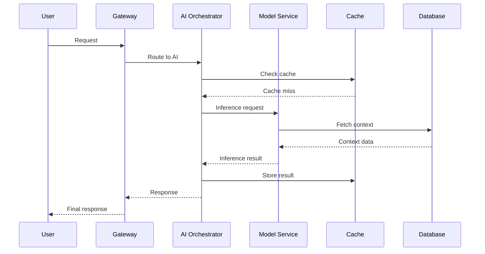

# 4. Les piliers d'une AI Platform réussie

*Scalabilité, Sécurité & Compliance, Observabilité & Feedback Loops, Modularité & Governance*

---

## 🏛️ Les 4 piliers fondamentaux

### 1. 📈 Scalabilité (Scalability)

#### Défis de la scalabilité IA
- **Modèles ML** : De GPT-2 (1.5B params) à GPT-4 (1.7T params)
- **Trafic** : De 100 req/min à 100K req/min
- **Données** : De GB à PB de données d'entraînement

#### Patterns de scalabilité

##### Horizontal Scaling des modèles
```python
# Pattern : Model sharding
class ShardedModel:
    def __init__(self, model_parts):
        self.shards = model_parts  # Liste de shards GPU
        self.load_balancer = RoundRobinLB()

    def predict(self, input_data):
        # Distribution intelligente des requêtes
        shard = self.load_balancer.select_shard(input_data)
        return shard.inference(input_data)
```

##### Caching multi-niveaux
```yaml
caching_strategy:
  l1_cache: # GPU Memory - 100ms latency
    size: 10GB
    eviction: LRU
  l2_cache: # Redis - 1ms latency
    size: 100GB
    ttl: 1h
  l3_cache: # S3 - 10ms latency
    size: 1TB
    ttl: 24h
```

#### Métriques de scalabilité
- **Throughput** : 1000 inferences/sec
- **Latency P95** : < 200ms
- **Cost per inference** : < $0.01

### 2. 🔒 Sécurité & Compliance (Security & Compliance)

#### Threat Model IA
```
┌─────────────────┐    ┌─────────────────┐    ┌─────────────────┐
│   User Input    │ -> │  AI Processing  │ -> │   AI Output     │
│                 │    │                 │    │                 │
│ • Prompt Injection│   │ • Model Poisoning│  │ • Data Leakage  │
│ • Jailbreaking   │   │ • Backdoors      │  │ • Hallucinations │
└─────────────────┘    └─────────────────┘    └─────────────────┘
```

#### Défense en profondeur

##### Input Sanitization
```python
def sanitize_input(user_input: str) -> str:
    """Nettoie les inputs utilisateur"""
    # Supprime les caractères dangereux
    sanitized = remove_dangerous_chars(user_input)

    # Détecte les patterns d'attaque
    if detect_prompt_injection(sanitized):
        raise SecurityException("Prompt injection detected")

    # Limite la longueur
    return truncate_to_max_length(sanitized)
```

##### Model Sandboxing
```yaml
model_sandbox:
  execution_environment:
    - isolated_containers
    - restricted_file_access
    - network_isolation
  resource_limits:
    - cpu: 2 cores
    - memory: 4GB
    - gpu: 1 device
  monitoring:
    - behavior_anomaly_detection
    - resource_usage_tracking
```

#### Compliance Frameworks
- **RGPD** : Droit à l'explication des décisions IA
- **SOX** : Auditabilité des processus automatisés
- **ISO 27001** : Sécurité des systèmes d'information

### 3. 📊 Observabilité & Feedback Loops (Observability & Feedback Loops)

#### Les 3 piliers de l'observabilité IA

##### Metrics (Métriques)
```python
ai_metrics = {
    'model_performance': {
        'accuracy': 0.94,
        'precision': 0.91,
        'recall': 0.87,
        'f1_score': 0.89
    },
    'infrastructure': {
        'latency_p50': 120,  # ms
        'latency_p95': 250,  # ms
        'throughput': 1500,  # req/sec
        'error_rate': 0.02   # 2%
    },
    'business_impact': {
        'user_satisfaction': 4.2,  # /5
        'time_saved_hours': 1200, # /month
        'cost_reduction_percent': 35
    }
}
```

##### Logs (Journaux)
```json
{
  "timestamp": "2024-01-15T10:30:00Z",
  "request_id": "req_12345",
  "user_id": "user_67890",
  "model_version": "claude-3-sonnet-20240229",
  "input_tokens": 150,
  "output_tokens": 200,
  "latency_ms": 180,
  "confidence_score": 0.89,
  "safety_check_passed": true,
  "feedback_score": null
}
```

##### Traces (Traçage)


#### Feedback Loops intelligents

##### Continuous Learning Pipeline
```python
class ContinuousLearning:
    def __init__(self):
        self.feedback_collector = FeedbackCollector()
        self.data_validator = DataValidator()
        self.model_trainer = ModelTrainer()
        self.deployment_manager = DeploymentManager()

    def learning_loop(self):
        while True:
            # 1. Collect feedback
            feedback = self.feedback_collector.gather_feedback()

            # 2. Validate data quality
            if self.data_validator.is_quality_sufficient(feedback):
                # 3. Retrain model
                new_model = self.model_trainer.retrain(feedback)

                # 4. Deploy incrementally
                self.deployment_manager.canary_deploy(new_model)

            time.sleep(3600)  # Every hour
```

### 4. 🧩 Modularité & Governance (Modularity & Governance)

#### Architecture modulaire

##### Skill-Based Design
```python
class AISkill:
    """Interface standard pour les skills IA"""
    def __init__(self, name: str, version: str):
        self.name = name
        self.version = version
        self.metadata = self.load_metadata()

    @abstractmethod
    def execute(self, context: dict) -> dict:
        """Exécution principale du skill"""
        pass

    @abstractmethod
    def validate_input(self, input_data: dict) -> bool:
        """Validation des inputs"""
        pass

    def get_capabilities(self) -> list:
        """Retourne les capacités du skill"""
        return self.metadata['capabilities']

# Exemple d'implémentation
class CodeReviewSkill(AISkill):
    def execute(self, context):
        code = context['code']
        analysis = self.analyze_code(code)
        suggestions = self.generate_suggestions(analysis)
        return {
            'analysis': analysis,
            'suggestions': suggestions,
            'confidence': self.calculate_confidence(analysis)
        }
```

##### Governance Framework
```yaml
governance_policies:
  skill_approval:
    - security_review_required: true
    - performance_benchmarking: true
    - bias_audit: true
    - documentation_complete: true

  deployment_rules:
    - canary_deployment: true
    - gradual_rollout: true
    - rollback_automatic: true
    - monitoring_extended: true

  usage_limits:
    - max_requests_per_hour: 10000
    - max_cost_per_month: 50000
    - max_latency_ms: 500
```

---

## 📋 Checklist : Évaluation des piliers

### Scalabilité ✅
- [ ] Architecture horizontale
- [ ] Caching efficace
- [ ] Auto-scaling configuré
- [ ] Métriques monitorées

### Sécurité ✅
- [ ] Input sanitization
- [ ] Sandboxing actif
- [ ] Audit trails complets
- [ ] Compliance respectée

### Observabilité ✅
- [ ] Métriques complètes
- [ ] Logging structuré
- [ ] Tracing distribué
- [ ] Alertes configurées

### Governance ✅
- [ ] Architecture modulaire
- [ ] Policies définies
- [ ] Approvals processes
- [ ] Documentation à jour

---

## 💡 Bonnes pratiques par pilier

### Scalabilité
- **Right-size your models** : Utilisez la taille minimale nécessaire
- **Implement caching aggressively** : Cache à tous les niveaux
- **Design for failure** : Graceful degradation

### Sécurité
- **Defense in depth** : Multiple couches de protection
- **Zero trust** : Vérifiez toujours
- **Regular audits** : Sécurité évolutive

### Observabilité
- **Monitor everything** : Métriques, logs, traces
- **Define SLOs** : Objectifs de service clairs
- **Feedback loops** : Apprentissage continu

### Governance
- **Modular design** : Skills réutilisables
- **Version everything** : Models, data, code
- **Document decisions** : Traçabilité complète

---

## 🚀 Synthèse

Les 4 piliers forment la fondation d'une AI Platform robuste. Chaque pilier renforce les autres :

- **Scalabilité** permet de gérer la croissance
- **Sécurité** protège les utilisateurs et données
- **Observabilité** fournit la visibilité nécessaire
- **Governance** assure la pérennité et conformité

Dans la Partie II, nous explorerons les paradigmes concrets : **Claude Skills vs GPT Agents**.
