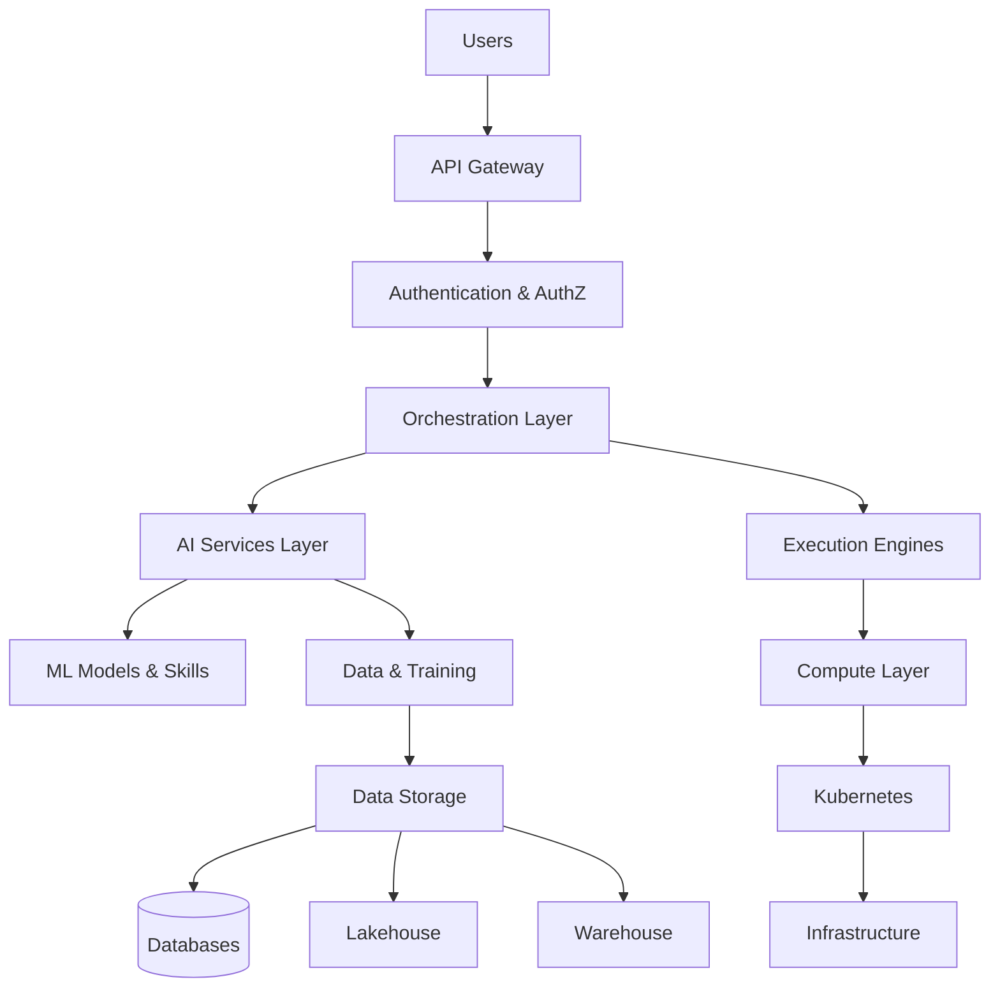

# 9. Blueprint of an AI-Powered IDP

*Architecture de référence : API Gateway, Model Orchestration, Data Layers*

---

## 🏗️ Architecture de référence

### Vue d'ensemble



### Les 6 couches de l'architecture

#### 1. Experience Layer (Couche Utilisateur)
**Interface et expérience**

```typescript
// API Gateway moderne avec IA
class AIEnhancedAPIGateway {
  @Route('/api/v1/execute')
  async executeTask(@Body() request: AIRequest): Promise<AIResponse> {
    // Validation intelligente de la requête
    const validation = await this.aiValidator.validate(request);

    // Routing basé sur l'intention
    const route = await this.intentRouter.route(request);

    // Orchestration de l'exécution
    const result = await this.orchestrator.execute(route, request);

    // Réponse enrichie avec métadonnées
    return this.responseEnricher.enrich(result);
  }
}
```

#### 2. Orchestration Layer (Couche Orchestration)
**Coordination intelligente**

```python
class IntelligentOrchestrator:
    def __init__(self):
        self.skill_registry = SkillRegistry()
        self.workflow_engine = WorkflowEngine()
        self.context_manager = ContextManager()

    async def execute_workflow(self, workflow_def: dict, context: dict):
        # Analyse du workflow
        analysis = await self.analyze_workflow(workflow_def)

        # Optimisation basée sur le contexte
        optimized = await self.optimize_for_context(analysis, context)

        # Exécution avec monitoring
        result = await self.execute_with_monitoring(optimized, context)

        # Apprentissage continu
        await self.learn_from_execution(result)

        return result
```

#### 3. AI Services Layer (Couche Services IA)
**Modèles et skills**

```yaml
ai_services:
  cognitive_services:
    - name: code_generation
      model: claude-3-sonnet
      capabilities: [python, javascript, java]
      scaling: horizontal

    - name: code_review
      model: gpt-4
      capabilities: [security, performance, best_practices]
      scaling: queue_based

  operational_services:
    - name: deployment_orchestrator
      type: custom_model
      capabilities: [kubernetes, docker, ci_cd]
      scaling: event_driven
```

#### 4. Data Layer (Couche Données)
**Mémoire et apprentissage**

```sql
-- Schema de data lake optimisé IA
CREATE SCHEMA ai_data_lake;

-- Feature store pour les modèles
CREATE TABLE features (
    entity_id UUID,
    feature_name VARCHAR(255),
    feature_value JSONB,
    timestamp TIMESTAMP,
    source VARCHAR(100),
    quality_score FLOAT,
    PRIMARY KEY (entity_id, feature_name, timestamp)
);

-- Training data avec métadonnées
CREATE TABLE training_data (
    id UUID PRIMARY KEY,
    data JSONB,
    labels JSONB,
    metadata JSONB,
    quality_score FLOAT,
    created_at TIMESTAMP,
    source VARCHAR(100)
);

-- Continuous learning metrics
CREATE TABLE model_metrics (
    model_name VARCHAR(255),
    version VARCHAR(50),
    metric_name VARCHAR(100),
    metric_value FLOAT,
    timestamp TIMESTAMP,
    environment VARCHAR(50)
);
```

#### 5. Execution Layer (Couche Exécution)
**Moteurs d'exécution**

```python
class ExecutionEngine:
    def __init__(self):
        self.container_runtime = ContainerRuntime()
        self.resource_manager = ResourceManager()
        self.monitoring = ExecutionMonitoring()

    async def execute_task(self, task: Task):
        # Allocation de ressources
        resources = await self.resource_manager.allocate(task.requirements)

        # Création du contexte d'exécution
        context = await self.create_execution_context(task, resources)

        # Exécution isolée
        result = await self.container_runtime.execute_isolated(context)

        # Nettoyage et métriques
        await self.cleanup_and_metrics(result)

        return result
```

#### 6. Infrastructure Layer (Couche Infrastructure)
**Fondation scalable**

```terraform
# Infrastructure as Code avec optimisation IA
resource "aws_eks_cluster" "ai_platform" {
  name     = "ai-powered-idp"
  version  = "1.28"

  vpc_config {
    subnet_ids = aws_subnet.private[*].id
  }

  # Auto-scaling intelligent
  dynamic "node_group" {
    for_each = var.ai_node_groups
    content {
      instance_types = node_group.value.instance_types
      min_size       = node_group.value.min_size
      max_size       = node_group.value.max_size

      # Scaling basé sur l'usage IA
      scaling_config {
        desired_size = node_group.value.desired_size
        min_size     = node_group.value.min_size
        max_size     = node_group.value.max_size
      }
    }
  }
}
```

---

## 🔧 Patterns architecturaux

### Event-Driven AI Architecture

```python
class EventDrivenAIPlatform:
    def __init__(self):
        self.event_bus = AIEventBus()
        self.skill_dispatcher = SkillDispatcher()
        self.state_manager = StateManager()

    async def process_event(self, event: AIEvent):
        # Analyse de l'événement
        analysis = await self.analyze_event(event)

        # Mise à jour de l'état
        state = await self.state_manager.update_state(analysis)

        # Dispatch vers les skills appropriés
        tasks = await self.skill_dispatcher.dispatch_based_on_state(state)

        # Exécution parallèle
        results = await self.execute_parallel_tasks(tasks)

        # Agrégation des résultats
        final_result = await self.aggregate_results(results)

        return final_result
```

### Microservices AI Pattern

```yaml
ai_microservices:
  code_intelligence_service:
    responsibilities:
      - Code analysis
      - Bug detection
      - Refactoring suggestions
    dependencies:
      - nlp_service
      - ast_parser
    scaling: horizontal

  deployment_automation_service:
    responsibilities:
      - Infrastructure provisioning
      - Application deployment
      - Configuration management
    dependencies:
      - cloud_provider_apis
      - security_scanner
    scaling: queue_based

  continuous_learning_service:
    responsibilities:
      - Model retraining
      - Performance monitoring
      - Data quality assessment
    dependencies:
      - feature_store
      - model_registry
    scaling: scheduled
```

---

## 📊 Métriques et monitoring

### Observabilité complète

#### Application Metrics
```python
platform_metrics = {
    'performance': {
        'api_response_time_p95': '< 500ms',
        'ai_inference_time_p95': '< 2s',
        'throughput': '> 1000 req/sec'
    },
    'reliability': {
        'uptime_sla': '99.9%',
        'error_rate': '< 0.1%',
        'rollback_success_rate': '> 99%'
    },
    'ai_specific': {
        'model_accuracy': '> 90%',
        'false_positive_rate': '< 5%',
        'user_satisfaction_score': '> 4.2/5'
    }
}
```

#### Infrastructure Monitoring
```prometheus
# Métriques Prometheus pour AI Platform
ai_model_inference_duration_seconds{quantile="0.5"} < 1.0
ai_model_inference_duration_seconds{quantile="0.95"} < 3.0
ai_model_accuracy > 0.85
ai_data_quality_score > 0.9
ai_resource_utilization_cpu < 0.8
ai_resource_utilization_memory < 0.9
```

---

## ⚖️ Trade-offs architecturaux

### Consistency vs Availability

#### Architecture CP (Consistency + Partition tolerance)
- **Avantages** : Données cohérentes, décisions déterministes
- **Usage** : Systèmes financiers, conformité stricte
- **Technologies** : PostgreSQL, Redis Cluster

#### Architecture AP (Availability + Partition tolerance)
- **Avantages** : Haute disponibilité, scalabilité
- **Usage** : Applications grand public, IoT
- **Technologies** : DynamoDB, Cassandra

### Coupling vs Autonomy

#### Tightly coupled (Skills-based)
```python
# Avantages : Performance, contrôle
workflow = LinearWorkflow([
    step1, step2, step3
])
result = workflow.execute(context)
```

#### Loosely coupled (Agent-based)
```python
# Avantages : Flexibilité, évolutivité
orchestrator = DynamicOrchestrator()
result = await orchestrator.execute_adaptive_workflow(goal, context)
```

---

## ✅ Checklist : Implémentation du blueprint

### Architecture Fundamentals ✅
- [ ] Couches clairement définies
- [ ] Interfaces standardisées
- [ ] Séparation des responsabilités
- [ ] Event-driven communication

### Scalability Design ✅
- [ ] Horizontal scaling des services
- [ ] Resource optimization
- [ ] Caching strategies
- [ ] Load balancing

### Observability ✅
- [ ] Métriques complètes
- [ ] Logging structuré
- [ ] Tracing distribué
- [ ] Alerting configuré

### Security ✅
- [ ] Authentication robuste
- [ ] Authorization granulaire
- [ ] Data encryption
- [ ] Audit trails

---

## 🚀 Vers la connexion des composants

Dans le prochain chapitre, nous explorerons comment **connecter APIs, workflows et skills** dans une architecture cohérente et performante.
