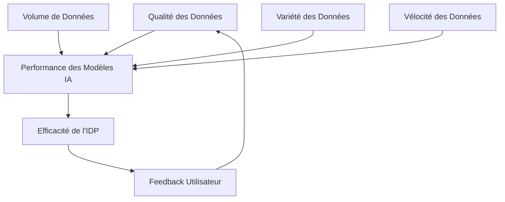

# 15. Data Engineering Inside IDPs

*Feature Stores, pipelines ML, feedback cycles*

---

## 🎯 L'importance des données dans les IDPs

### Data comme carburant de l'IA

#### Le triangle data-IA-performance


#### Métriques de succès data-driven
- **Data Quality Score** : > 95%
- **Feature Freshness** : < 1 heure de latence
- **Model Performance** : Amélioration continue > 5%/mois
- **Feedback Loop Efficiency** : < 10 minutes

---

## 🏗️ Feature Store Architecture

### Intelligent Feature Store

#### Architecture moderne
```python
class IntelligentFeatureStore:
    """Feature Store intelligent pour IDPs"""

    def __init__(self):
        self.feature_registry = FeatureRegistry()
        self.data_ingestion = DataIngestionPipeline()
        self.feature_engineering = FeatureEngineeringPipeline()
        self.feature_serving = FeatureServingLayer()
        self.quality_monitor = DataQualityMonitor()
        self.freshness_tracker = FreshnessTracker()

    async def store_and_serve_features(self, feature_definition: FeatureDefinition) -> FeatureResult:
        """Stockage et service intelligent des features"""

        # 1. Validation de la définition
        validation = await self.validate_feature_definition(feature_definition)

        # 2. Ingestion des données brutes
        raw_data = await self.data_ingestion.ingest_data(feature_definition.source)

        # 3. Ingénierie des features
        engineered_features = await self.feature_engineering.engineer_features(
            raw_data, feature_definition.transformations
        )

        # 4. Validation qualité
        quality_check = await self.quality_monitor.validate_quality(engineered_features)

        if not quality_check.passed:
            # Correction automatique si possible
            corrected_features = await self.auto_correct_features(
                engineered_features, quality_check.issues
            )
            engineered_features = corrected_features

        # 5. Stockage optimisé
        storage_result = await self.store_features_optimized(
            engineered_features, feature_definition
        )

        # 6. Configuration du serving
        serving_config = await self.configure_feature_serving(
            storage_result, feature_definition.serving_requirements
        )

        # 7. Monitoring continu
        monitoring_setup = await self.setup_feature_monitoring(
            storage_result, feature_definition
        )

        return FeatureResult(
            feature_id=storage_result.feature_id,
            storage_location=storage_result.location,
            serving_endpoint=serving_config.endpoint,
            quality_score=quality_check.score,
            freshness_sla=feature_definition.freshness_requirements,
            monitoring_dashboard=monitoring_setup.dashboard_url
        )
```

#### Feature versioning et lineage
```python
class FeatureVersionManager:
    """Gestion des versions et lineage des features"""

    def __init__(self):
        self.version_store = FeatureVersionStore()
        self.lineage_tracker = FeatureLineageTracker()
        self.compatibility_checker = FeatureCompatibilityChecker()

    async def create_feature_version(self, feature: Feature, changes: List[Change]) -> FeatureVersion:
        """Création d'une nouvelle version de feature"""

        # 1. Calcul de la nouvelle version
        new_version = await self.calculate_next_version(feature.current_version, changes)

        # 2. Validation des changements
        compatibility_check = await self.compatibility_checker.check_compatibility(
            feature, changes
        )

        if not compatibility_check.compatible:
            raise IncompatibleChangesError(compatibility_check.issues)

        # 3. Création de la version
        version_data = FeatureVersionData(
            feature_id=feature.id,
            version=new_version,
            changes=changes,
            created_at=datetime.now(),
            parent_version=feature.current_version,
            metadata={
                'breaking_changes': compatibility_check.breaking_changes,
                'performance_impact': compatibility_check.performance_impact,
                'backwards_compatible': compatibility_check.backwards_compatible
            }
        )

        # 4. Stockage de la version
        stored_version = await self.version_store.store_version(version_data)

        # 5. Mise à jour du lineage
        await self.lineage_tracker.update_lineage(feature.id, stored_version)

        # 6. Notification des consommateurs
        await self.notify_consumers(feature.id, stored_version)

        return stored_version

    async def get_feature_lineage(self, feature_id: str, version: str = None) -> FeatureLineage:
        """Récupération du lineage complet d'une feature"""

        lineage_graph = await self.lineage_tracker.get_lineage_graph(feature_id, version)

        # Enrichissement avec métadonnées
        enriched_lineage = await self.enrich_lineage_with_metadata(lineage_graph)

        # Analyse d'impact
        impact_analysis = await self.analyze_lineage_impact(enriched_lineage)

        return FeatureLineage(
            feature_id=feature_id,
            lineage_graph=enriched_lineage,
            impact_analysis=impact_analysis,
            recommendations=self.generate_lineage_recommendations(impact_analysis)
        )
```

---

## 🔄 ML Pipeline Orchestration

### Intelligent ML Pipelines

#### Pipeline auto-optimisant
```python
class SelfOptimizingMLPipeline:
    """Pipeline ML qui s'auto-optimise"""

    def __init__(self):
        self.data_preparation = DataPreparationStage()
        self.feature_selection = FeatureSelectionStage()
        self.model_training = ModelTrainingStage()
        self.model_evaluation = ModelEvaluationStage()
        self.model_deployment = ModelDeploymentStage()
        self.performance_monitor = PerformanceMonitor()
        self.optimization_engine = PipelineOptimizationEngine()

    async def execute_optimized_pipeline(self, pipeline_config: PipelineConfig) -> PipelineResult:
        """Exécution d'un pipeline ML optimisé"""

        execution_context = PipelineExecutionContext(
            config=pipeline_config,
            start_time=datetime.now()
        )

        try:
            # Phase 1: Préparation des données
            data_prep_result = await self.execute_data_preparation(execution_context)
            execution_context = execution_context.update_stage('data_prep', data_prep_result)

            # Phase 2: Sélection des features (optimisée)
            feature_selection_result = await self.execute_feature_selection_optimized(
                execution_context
            )
            execution_context = execution_context.update_stage('feature_selection', feature_selection_result)

            # Phase 3: Entraînement du modèle
            training_result = await self.execute_model_training_optimized(execution_context)
            execution_context = execution_context.update_stage('training', training_result)

            # Phase 4: Évaluation
            evaluation_result = await self.execute_model_evaluation(execution_context)
            execution_context = execution_context.update_stage('evaluation', evaluation_result)

            # Phase 5: Déploiement conditionnel
            deployment_result = await self.execute_conditional_deployment(
                execution_context, evaluation_result
            )
            execution_context = execution_context.update_stage('deployment', deployment_result)

            # Phase 6: Optimisation pour le prochain run
            optimization_result = await self.optimize_for_next_run(execution_context)

            return PipelineResult(
                success=True,
                execution_context=execution_context,
                optimization_insights=optimization_result,
                performance_metrics=self.calculate_pipeline_metrics(execution_context)
            )

        except Exception as e:
            # Gestion d'erreur avec apprentissage
            error_handling_result = await self.handle_pipeline_error(e, execution_context)
            return PipelineResult(
                success=False,
                error=str(e),
                execution_context=execution_context,
                error_handling=error_handling_result
            )

    async def execute_feature_selection_optimized(self, context: PipelineExecutionContext):
        """Sélection de features optimisée par l'IA"""

        # Analyse des features disponibles
        available_features = context.get_data_prep_result().features

        # Prédiction d'importance des features
        feature_importance = await self.feature_selection.predict_importance(
            available_features, context.config.target_metric
        )

        # Sélection optimale selon les contraintes
        optimal_features = await self.feature_selection.select_optimal_subset(
            available_features, feature_importance,
            max_features=context.config.max_features,
            computation_budget=context.config.computation_budget
        )

        return FeatureSelectionResult(
            selected_features=optimal_features,
            importance_scores=feature_importance,
            selection_criteria={
                'method': 'ai_optimized',
                'optimization_goal': context.config.target_metric,
                'constraints_satisfied': self.verify_constraints(optimal_features, context.config)
            }
        )
```

#### MLOps avec feedback loops
```python
class MLOpsWithFeedback:
    """MLOps avec boucles de feedback intelligentes"""

    def __init__(self):
        self.experiment_tracker = ExperimentTracker()
        self.model_registry = ModelRegistry()
        self.feedback_collector = FeedbackCollector()
        self.continuous_trainer = ContinuousTrainer()

    async def run_mlops_cycle(self, model_config: ModelConfig) -> MLOpsCycleResult:
        """Cycle complet MLOps avec feedback"""

        # 1. Tracking d'expériences
        experiment = await self.experiment_tracker.start_experiment(model_config)

        # 2. Entraînement initial
        initial_training = await self.train_initial_model(experiment)

        # 3. Enregistrement du modèle
        model_version = await self.model_registry.register_model(
            initial_training.model, experiment
        )

        # 4. Déploiement progressif
        deployment = await self.deploy_model_progressively(model_version)

        # 5. Collecte de feedback en production
        feedback_collection = await self.setup_feedback_collection(deployment)

        # 6. Monitoring continu et retraining
        monitoring_task = asyncio.create_task(
            self.monitor_and_retrain(deployment, feedback_collection)
        )

        return MLOpsCycleResult(
            experiment=experiment,
            initial_model=model_version,
            deployment=deployment,
            feedback_collection=feedback_collection,
            monitoring_task=monitoring_task,
            cycle_metadata={
                'start_time': experiment.start_time,
                'expected_completion': self.calculate_cycle_completion(experiment),
                'feedback_loop_active': True
            }
        )

    async def monitor_and_retrain(self, deployment, feedback_collection):
        """Monitoring continu avec retraining automatique"""

        while True:
            # Collecte des métriques de performance
            performance_metrics = await self.collect_performance_metrics(deployment)

            # Analyse du drift des données
            data_drift = await self.analyze_data_drift(feedback_collection)

            # Analyse du drift du modèle
            model_drift = await self.analyze_model_drift(performance_metrics)

            # Décision de retraining
            if self.should_retrain(data_drift, model_drift, performance_metrics):
                # Retraining automatique
                new_model = await self.continuous_trainer.retrain_model(
                    deployment.current_model,
                    feedback_collection,
                    data_drift,
                    model_drift
                )

                # Validation du nouveau modèle
                validation = await self.validate_new_model(new_model, deployment)

                if validation.passed:
                    # Déploiement du nouveau modèle
                    await self.deploy_new_model_version(new_model, deployment)

            # Attente avant le prochain cycle de monitoring
            await asyncio.sleep(self.retraining_check_interval)
```

---

## 🔄 Feedback Cycles intelligents

### Continuous Learning Loops

#### Architecture de feedback
```python
class IntelligentFeedbackLoop:
    """Boucle de feedback intelligente"""

    def __init__(self):
        self.feedback_ingestion = FeedbackIngestionPipeline()
        self.feedback_processing = FeedbackProcessingEngine()
        self.model_retraining = ModelRetrainingEngine()
        self.performance_evaluation = PerformanceEvaluationEngine()
        self.decision_engine = FeedbackDecisionEngine()

    async def process_feedback_cycle(self, model: AIModel, feedback_stream: FeedbackStream) -> FeedbackCycleResult:
        """Traitement d'un cycle de feedback complet"""

        # 1. Ingestion du feedback
        ingested_feedback = await self.feedback_ingestion.ingest_feedback(feedback_stream)

        # 2. Validation et nettoyage
        validated_feedback = await self.feedback_processing.validate_and_clean(
            ingested_feedback
        )

        # 3. Analyse du feedback
        feedback_analysis = await self.feedback_processing.analyze_feedback(
            validated_feedback
        )

        # 4. Évaluation de la nécessité de retraining
        retraining_decision = await self.decision_engine.decide_retraining(
            model, feedback_analysis
        )

        cycle_result = {
            'ingested_feedback_count': len(ingested_feedback),
            'validated_feedback_count': len(validated_feedback),
            'feedback_quality_score': feedback_analysis.quality_score,
            'retraining_recommended': retraining_decision.retrain,
            'retraining_confidence': retraining_decision.confidence
        }

        if retraining_decision.retrain:
            # 5. Retraining du modèle
            retraining_result = await self.model_retraining.retrain_model(
                model, validated_feedback, feedback_analysis
            )

            # 6. Évaluation du nouveau modèle
            evaluation_result = await self.performance_evaluation.evaluate_model(
                retraining_result.new_model, feedback_analysis
            )

            # 7. Décision de déploiement
            deployment_decision = await self.decision_engine.decide_deployment(
                evaluation_result, retraining_decision
            )

            cycle_result.update({
                'new_model_performance': evaluation_result.metrics,
                'deployment_recommended': deployment_decision.deploy,
                'performance_improvement': evaluation_result.improvement_over_baseline,
                'deployment_confidence': deployment_decision.confidence
            })

        return FeedbackCycleResult(**cycle_result)

    async def optimize_feedback_loop(self, historical_cycles: List[FeedbackCycleResult]) -> LoopOptimization:
        """Optimisation de la boucle de feedback basée sur l'historique"""

        # Analyse des patterns de succès/échec
        pattern_analysis = await self.analyze_historical_patterns(historical_cycles)

        # Identification des bottlenecks
        bottlenecks = await self.identify_feedback_bottlenecks(pattern_analysis)

        # Génération de recommandations d'optimisation
        optimization_recommendations = await self.generate_optimization_recommendations(
            bottlenecks, pattern_analysis
        )

        # Application des optimisations
        applied_optimizations = await self.apply_feedback_optimizations(
            optimization_recommendations
        )

        return LoopOptimization(
            pattern_analysis=pattern_analysis,
            bottlenecks=bottlenecks,
            recommendations=optimization_recommendations,
            applied_optimizations=applied_optimizations,
            expected_improvements=self.calculate_expected_improvements(applied_optimizations)
        )
```

---

## 📊 Data Quality Management

### Intelligent Data Quality Framework

#### Validation et monitoring qualité
```python
class IntelligentDataQualityManager:
    """Gestionnaire intelligent de la qualité des données"""

    def __init__(self):
        self.quality_metrics_calculator = QualityMetricsCalculator()
        self.anomaly_detector = DataAnomalyDetector()
        self.auto_corrector = DataAutoCorrector()
        self.quality_predictor = DataQualityPredictor()

    async def ensure_data_quality(self, data_pipeline: DataPipeline) -> QualityAssuranceResult:
        """Assurance qualité complète des données"""

        quality_results = {}

        # 1. Calcul des métriques de qualité
        quality_metrics = await self.quality_metrics_calculator.calculate_metrics(
            data_pipeline
        )

        # 2. Détection d'anomalies
        anomalies = await self.anomaly_detector.detect_anomalies(
            data_pipeline, quality_metrics
        )

        # 3. Prédiction de la qualité future
        quality_predictions = await self.quality_predictor.predict_future_quality(
            data_pipeline, quality_metrics, anomalies
        )

        # 4. Corrections automatiques si nécessaire
        if anomalies or quality_metrics.overall_score < self.quality_threshold:
            corrections = await self.auto_corrector.apply_corrections(
                data_pipeline, anomalies, quality_metrics
            )
            quality_results['corrections_applied'] = corrections

        # 5. Génération de rapports de qualité
        quality_report = await self.generate_quality_report(
            quality_metrics, anomalies, quality_predictions
        )

        # 6. Recommandations d'amélioration
        recommendations = await self.generate_quality_recommendations(
            quality_report, data_pipeline
        )

        return QualityAssuranceResult(
            quality_metrics=quality_metrics,
            anomalies_detected=anomalies,
            quality_predictions=quality_predictions,
            corrections_applied=quality_results.get('corrections_applied', []),
            quality_report=quality_report,
            recommendations=recommendations,
            overall_quality_score=quality_metrics.overall_score,
            quality_trend=quality_predictions.trend
        )
```

#### Métriques de qualité des données
```python
data_quality_metrics = {
    'accuracy': {
        'definition': 'Exactitude des valeurs par rapport à la réalité',
        'calculation': 'percentage_of_accurate_records',
        'target': '> 98%',
        'critical_threshold': '95%'
    },
    'completeness': {
        'definition': 'Pourcentage de valeurs non-nulles',
        'calculation': 'percentage_of_non_null_values',
        'target': '> 95%',
        'critical_threshold': '90%'
    },
    'consistency': {
        'definition': 'Cohérence interne des données',
        'calculation': 'consistency_score_based_on_rules',
        'target': '> 96%',
        'critical_threshold': '92%'
    },
    'timeliness': {
        'definition': 'Fraîcheur temporelle des données',
        'calculation': 'data_age_vs_sla',
        'target': '< 1 hour lag',
        'critical_threshold': '4 hours'
    },
    'validity': {
        'definition': 'Conformité aux règles métier',
        'calculation': 'percentage_of_valid_records',
        'target': '> 97%',
        'critical_threshold': '94%'
    }
}
```

---

## 🚀 Data Pipeline Orchestration

### Streaming et batch processing intelligent

#### Adaptive Data Pipelines
```python
class AdaptiveDataPipeline:
    """Pipeline de données adaptatif"""

    def __init__(self):
        self.stream_processor = StreamProcessor()
        self.batch_processor = BatchProcessor()
        self.pipeline_optimizer = PipelineOptimizer()
        self.resource_manager = ResourceManager()

    async def execute_adaptive_pipeline(self, pipeline_spec: PipelineSpec) -> PipelineExecutionResult:
        """Exécution d'un pipeline adaptatif"""

        # 1. Analyse de la charge de travail
        workload_analysis = await self.analyze_workload(pipeline_spec)

        # 2. Choix de la stratégie d'exécution
        execution_strategy = await self.choose_execution_strategy(
            workload_analysis, pipeline_spec
        )

        # 3. Allocation des ressources
        resource_allocation = await self.resource_manager.allocate_resources(
            execution_strategy, workload_analysis
        )

        # 4. Exécution selon la stratégie
        if execution_strategy.type == 'streaming':
            result = await self.stream_processor.process_streaming(
                pipeline_spec, resource_allocation
            )
        elif execution_strategy.type == 'batch':
            result = await self.batch_processor.process_batch(
                pipeline_spec, resource_allocation
            )
        else:  # hybrid
            result = await self.process_hybrid(
                pipeline_spec, execution_strategy, resource_allocation
            )

        # 5. Optimisation pour les futures exécutions
        optimization = await self.pipeline_optimizer.optimize_for_future(
            result, workload_analysis
        )

        return PipelineExecutionResult(
            execution_result=result,
            execution_strategy=execution_strategy,
            resource_usage=resource_allocation,
            optimization_insights=optimization,
            performance_metrics=self.calculate_performance_metrics(result)
        )

    async def choose_execution_strategy(self, workload_analysis, pipeline_spec):
        """Choix intelligent de la stratégie d'exécution"""

        # Facteurs de décision
        factors = {
            'data_volume': workload_analysis.data_volume,
            'latency_requirement': pipeline_spec.latency_requirement,
            'throughput_requirement': pipeline_spec.throughput_requirement,
            'data_freshness': pipeline_spec.data_freshness_requirement,
            'cost_constraint': pipeline_spec.cost_constraint,
            'historical_performance': workload_analysis.historical_performance
        }

        # Règles de décision
        if factors['latency_requirement'] == 'real_time':
            return ExecutionStrategy(type='streaming', priority='latency')
        elif factors['data_volume'] > self.large_dataset_threshold:
            return ExecutionStrategy(type='batch', priority='throughput')
        elif factors['cost_constraint'] == 'low':
            return ExecutionStrategy(type='batch', priority='cost')
        else:
            # Analyse prédictive pour optimiser le coût/performance
            prediction = await self.predict_optimal_strategy(factors)
            return prediction.optimal_strategy
```

---

## ✅ Checklist : Data Engineering dans les IDPs

### Feature Store ✅
- [ ] Architecture de feature store intelligente
- [ ] Gestion des versions et lineage
- [ ] Service haute performance
- [ ] Monitoring de fraîcheur

### ML Pipelines ✅
- [ ] Orchestration auto-optimisante
- [ ] MLOps avec feedback loops
- [ ] Gestion des expérimentations
- [ ] Déploiement progressif

### Feedback Cycles ✅
- [ ] Ingestion de feedback temps réel
- [ ] Retraining automatique
- [ ] Évaluation continue de performance
- [ ] Optimisation des boucles

### Qualité des Données ✅
- [ ] Métriques de qualité complètes
- [ ] Validation automatique
- [ ] Corrections auto-appliquées
- [ ] Monitoring prédictif

---

## 🚀 Vers l'ère agentique

Dans la **Partie V**, nous explorerons **l'Agentic Future** : l'évolution des chatbots vers des agents autonomes, les patterns d'orchestration d'agents, et l'importance du human-in-the-loop pour la sécurité et le contrôle.
